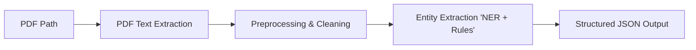

# ResumeParsing
Low cost resume parsing method.



```mermaid
flowchart LR
    A[PDF Path] --> B[PDF Text Extraction]
    B --> C[Preprocessing & Cleaning]
    C --> D[Entity Extraction 'NER + Rules']
    D --> E[Structured JSON Output]
```


```bash
pip install uv
```
```bash
uv venv
```
```bash
uv sync
```